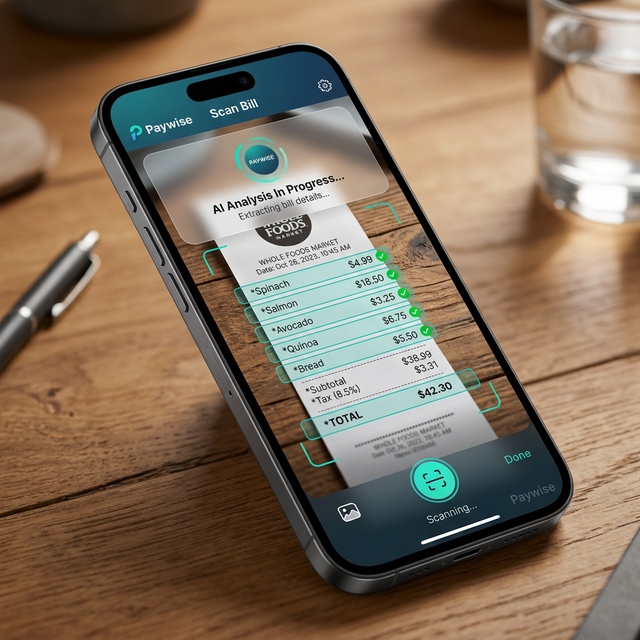

#  Paywise - Effortless Expense Splitting

## 🚀 Overview
**Paywise** is a next-generation expense management and bill-splitting application designed to take the stress out of group finances. Whether you're sharing a meal, splitting rent with roommates, or managing travel expenses, Paywise provides a sleek, AI-powered platform to track, split, and settle up with precision.

Available at: [www.paywiseapp.com](https://www.paywiseapp.com)

---

## ✨ Core Features

### 📸 AI-Powered Bill Scanning
Stop manual entry. Upload a photo of your receipt, and our AI instantly extracts items, prices, and taxes, allowing you to assign them to friends with a single tap.

### 👥 Group & Friend Management
Organize your life into groups (Home, Trip, Dinner) or track one-on-one debts with ease. View clear "who owes who" summaries at a glance.

### 🔄 Splitwise Migration
Moving from Splitwise? Our one-click migration tool imports your entire history, groups, and balances so you never lose track of your records.

### 🔐 Advanced Security
Stay protected with **Email OTP verification**, **Biometric Authentication (FaceID/TouchID)**, and end-to-end secure transactions.

### 📱 Progressive Web App (PWA)
Install Paywise on your home screen for a native app experience on iOS and Android without needing the App Store.

### 🌍 Multi-Currency Support
Travel the world with confidence. Paywise handles multiple currencies with real-time conversion and historical tracking.

---

## 🛠 Tech Stack (Frontend)
- **Framework:** React 19 (Vite)
- **Styling:** Tailwind CSS 4
- **Icons:** Lucide React
- **OCR & AI Engine:** Tesseract.js & Google Gemini AI (1.5 Flash)
- **Monetization:** Google AdSense (AdGate Integration)
- **State Management:** React Context API
- **Routing:** React Router 7
- **Exports:** jsPDF (AutoTable) for financial reporting

---

## 📜 Version History & Release Log

### v1.4.0 - The "Intelligence & Precision" Update
*Released: March 24, 2026*

#### 🤖 Paywise AI (Powered by Gemini)
- **Conversational Expenses:** Add expenses, check balances ("Who owes me?"), or delete records using natural language.
- **Floating AI Assistant:** Access the AI from any page with the new floating spark button.
- **Action Confirmation:** AI proposes actions (Add, Delete, Settle) which you can confirm with one tap.
- **Smart Suggestions:** Get personalized prompt suggestions based on your recent activity.

#### 💰 Advanced Financial Features
- **Partial Settlements:** Ability to record partial payments instead of just full balance clears.
- **Individual Expense Settlement:** Settle specific bills within a group rather than just the total balance.
- **Monthly Budgets:** Set spending limits and get visual warnings (orange balance) when approaching them.
- **Default Split Methods:** Set your preferred split logic (Equal, Percentage, etc.) in settings.
- **Privacy Mode:** "Hide Balance" feature to blur sensitive totals when using the app in public.

#### 🔐 Security & Personalization
- **Next-Gen Biometrics:** Secure your app with FaceID, TouchID, or Fingerprint (WebAuthn).
- **Secure PIN Fallback:** Custom PIN lock for devices without biometric hardware.
- **Profile Visibility:** Control whether people can find you via email discovery.
- **Auto-Accept Friends:** Option to automatically approve friend requests from known contacts.
- **Comprehensive Account Management:** Secure, verified account deletion flow.

#### 🌍 Experience & Accessibility
- **Multi-Language Support:** Now available in 10+ languages including Spanish, French, Hindi, and more.
- **High Contrast Mode:** Enhanced UI visibility for better readability.
- **Custom Localization:** Personalize date (MM/DD/YYYY vs DD/MM/YYYY) and time (12h/24h) formats.
- **Payment Reminders:** Quick-share reminder templates for friends with outstanding balances.

#### 🛠 Stability & Performance
- **Global Error Boundary:** Improved app resilience with automated crash recovery and reporting.
- **Cache Management:** Tools to clear local storage and fix sluggish behavior.
- **Ad-Supported Access:** Integrated Google AdSense (AdGate) to unlock premium features for free.
- **Refined Refactor:** Optimized 35+ core components for faster transitions and lower memory usage.

### v1.3.0 - The "Migration & Mobility" Update
*Released: March 10, 2026*
- **Splitwise Migration:** Full import support for Splitwise data.
- **PWA Enhancement:** Custom install prompts for Android and iOS.
- **Improved PDF Reporting:** Export detailed group settlement reports.
- **Multi-Currency Fixes:** Enhanced historical data representation for non-USD accounts.

### v1.2.0 - The "Security First" Update
*Released: March 5, 2026*
- **Biometric Lock:** Secure your app with FaceID/Fingerprint integration.
- **Email OTP:** Two-factor authentication for registration and sensitive actions.
- **Activity Feed:** Real-time notifications for expense additions and settlements.

### v1.1.0 - The "Intelligence" Update
*Released: February 25, 2026*
- **AI Scan Bill:** Integrated Tesseract + Gemini for high-accuracy receipt parsing.
- **itemized Splitting:** Ability to split specific items on a bill rather than just the total.
- **Image Cloud Storage:** profile pictures and receipt images now stored securely via Oracle Cloud Infrastructure (OCI).

### v1.0.0 - Initial Launch
*Released: February 1, 2026*
- **Core Groups:** Creation and management of expense groups.
- **Friend System:** Add and invite friends via email.
- **Expense Engine:** Percentage, exact amount, and equal split logic.
- **Dashboard:** Real-time balance tracking.

---

© 2026 Paywise App and Gd Enterprises. All rights reserved. Visit us at [www.paywiseapp.com](https://www.paywiseapp.com).
